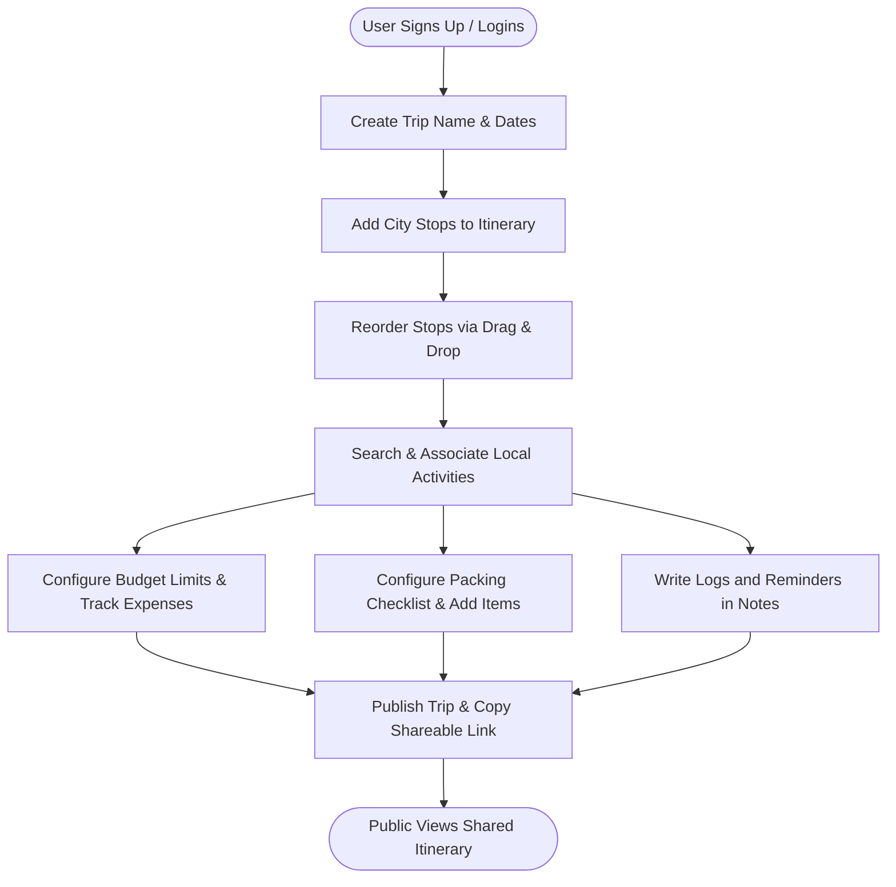
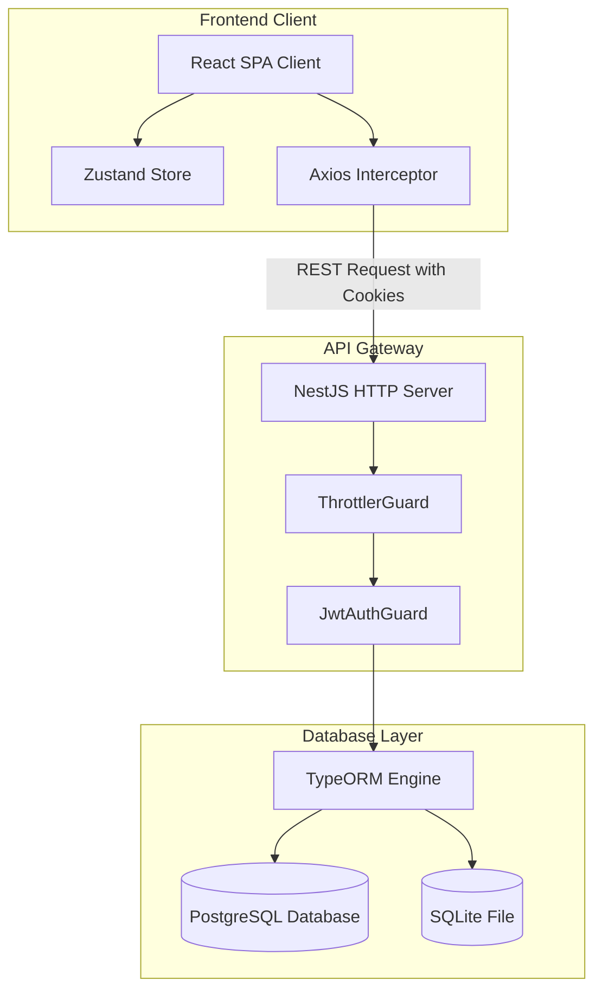
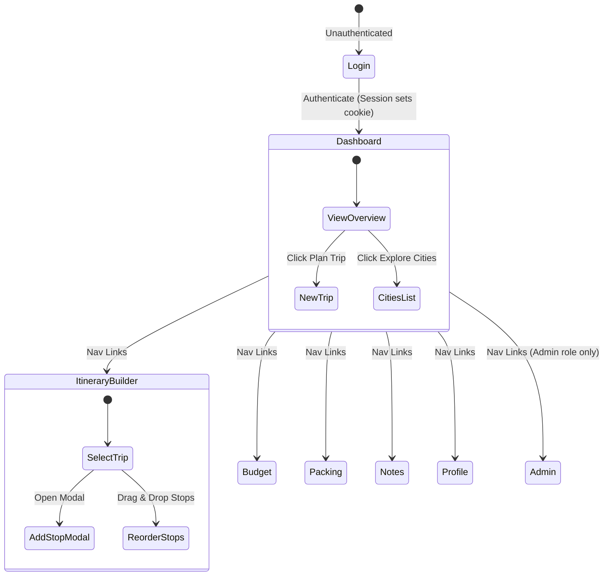
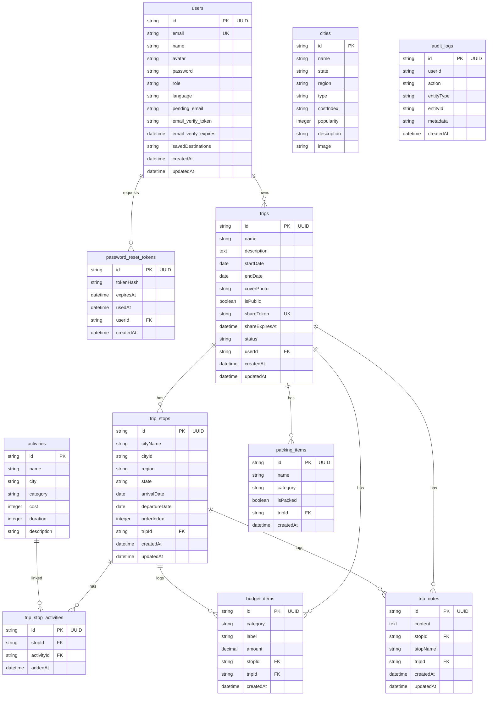
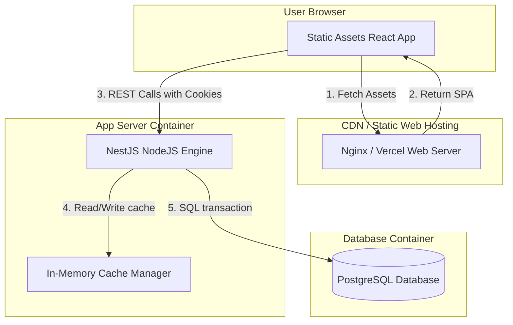

# DesiVagabond Complete Project Documentation

This document provides an exhaustive technical overview, system design, API catalog, database schema, and design reference for the **DesiVagabond** (Traveloop) platform. Every description is derived directly from the active files and configuration in the codebase.

---

## 1. Executive Summary

### Project Name
**DesiVagabond** (referred to as "traveloop" in internal package configurations)

### Purpose
DesiVagabond is a personalized travel planning application designed to simplify, structure, and enhance the travel experience, with a specific focus on trip destinations within India. It enables users to build multi-city itineraries, manage travel budgets, compile packing checklists, maintain private travel journals, and share travel plans with the public through secure sharing tokens.

### Main Features
1. **🔐 Authentication & Verification**: Secure registration, login, logout, and profile management using HTTP-only cookies, combined with cryptographic reset-password and email change verification flows.
2. **🗺️ Multi-City Itinerary Builder**: An interactive schedule planner where users select Indian cities, set arrival/departure dates, and drag-and-drop to reorder stops.
3. **🔍 Destination & Activity Directories**: Fully filterable directories for exploring cities by region/type and local activities by category, state, or max cost index.
4. **💰 Cost Tracker & Budget Tracker**: Log budget items in customizable categories (Transport, Stay, Activities, Meals, Other) against an optional budget limit with over-budget alerts.
5. **🧳 Packing Checklist**: Dynamically grouped categories with preset suggestions to populate checklists, coupled with interactive packed progress indicators.
6. **📓 Trip Notes**: Rich text log cards associated with specific trips for travel journals, addresses, and contacts.
7. **🔗 Shared Public Itineraries**: Public share tokens to allow read-only web access to trip timelines with expiry checks.
8. **👤 User Profile Preferences**: User-configurable settings including name updates, avatar pickers, preferred language, and account deletion.
9. **📊 Admin Analytics Dashboard**: Key metrics on system engagement, destination popularity distributions, user growth metrics, and paginated system audit logs.
10. **🐳 Containerized Database**: Multi-environment config supporting SQLite (local dev fallback) and PostgreSQL (production Docker Compose setup).

### Target Users
- Individual travelers seeking organized itineraries.
- Groups seeking unified packing checklists and note cards.
- System administrators monitoring user engagement and popular destination trends.

### Business Workflow


### Technology Stack
- **Frontend**: React 19, TypeScript, Vite, Tailwind CSS, Zustand, GSAP (PillNav animations), Framer Motion, Three.js (interactive canvas), Chart.js (react-chartjs-2).
- **Backend**: Node.js, NestJS v11, TypeORM, `@nestjs/throttler` (rate limits), `@nestjs/cache-manager` (in-memory caching), Passport JWT.
- **Database**: PostgreSQL (`pg` driver) for production, SQLite (`better-sqlite3` driver) for local fallback.

---

## 2. Repository Structure

### Folder Tree
```
desivagabond/
├── backend/
│   ├── src/
│   │   ├── activities/                # Activity catalog services, entities, controllers
│   │   │   ├── activities.controller.ts
│   │   │   ├── activities.module.ts
│   │   │   ├── activities.service.ts
│   │   │   └── activity.entity.ts
│   │   ├── admin/                     # Admin analytics and audit logs
│   │   │   ├── admin.controller.ts
│   │   │   ├── admin.module.ts
│   │   │   └── entities/
│   │   │       └── audit-log.entity.ts
│   │   ├── auth/                      # Authentication, guard, reset token logic
│   │   │   ├── auth.controller.ts
│   │   │   ├── auth.module.ts
│   │   │   ├── auth.service.ts
│   │   │   ├── jwt-auth.guard.ts
│   │   │   ├── jwt.strategy.ts
│   │   │   └── entities/
│   │   │       └── password-reset-token.entity.ts
│   │   ├── cities/                    # City catalog services, entities, controllers
│   │   │   ├── cities.controller.ts
│   │   │   ├── cities.module.ts
│   │   │   ├── cities.service.ts
│   │   │   └── city.entity.ts
│   │   ├── database/                  # Seeding script and configurations
│   │   │   └── seed.ts
│   │   ├── migrations/                # Database TypeORM migrations
│   │   │   ├── 1782630294523-SchemaInit.ts
│   │   │   ├── 1782630462961-AddUpdatedAtToTripStop.ts
│   │   │   ├── 1782633964066-AddShareExpiresAtToTrip.ts
│   │   │   ├── 1782635570027-AddPasswordResetToken.ts
│   │   │   ├── 1782635800503-TripStopActivities.ts
│   │   │   └── 1782635915896-DropActivitiesFromTripStop.ts
│   │   ├── shared/                    # Shared DTOs and modules
│   │   │   ├── shared.controller.ts
│   │   │   ├── shared.module.ts
│   │   │   └── dto/
│   │   │       └── pagination.dto.ts
│   │   ├── trips/                     # Core trip planner module, entities, stops, notes, lists
│   │   │   ├── entities/
│   │   │   │   ├── budget-item.entity.ts
│   │   │   │   ├── packing-item.entity.ts
│   │   │   │   ├── trip-note.entity.ts
│   │   │   │   ├── trip-stop-activity.entity.ts
│   │   │   │   ├── trip-stop.entity.ts
│   │   │   │   └── trip.entity.ts
│   │   │   ├── trips.controller.ts
│   │   │   ├── trips.module.ts
│   │   │   └── trips.service.ts
│   │   ├── users/                     # Users profile and accounts
│   │   │   ├── user.entity.ts
│   │   │   ├── users.controller.ts
│   │   │   ├── users.module.ts
│   │   │   └── users.service.ts
│   │   ├── app.controller.ts
│   │   ├── app.module.ts
│   │   ├── app.service.ts
│   │   ├── data-source.ts
│   │   └── main.ts
│   ├── package.json
│   └── tsconfig.json
├── frontend/
│   ├── src/
│   │   ├── assets/                    # Static image/vector resources
│   │   ├── components/                # Reusable layout and custom Nav components
│   │   │   ├── CityImage.tsx
│   │   │   ├── Layout.tsx
│   │   │   ├── PillNav.css
│   │   │   └── PillNav.tsx
│   │   ├── constants/                 # Constant configs (gradients, lists)
│   │   │   └── cityBannerGradients.ts
│   │   ├── hooks/                     # 3D interactive canvases (Three.js)
│   │   │   └── useThree.ts
│   │   ├── pages/                     # Routed view page components
│   │   │   ├── ActivitySearch.tsx
│   │   │   ├── Admin.tsx
│   │   │   ├── Budget.tsx
│   │   │   ├── CitySearch.tsx
│   │   │   ├── CreateTrip.tsx
│   │   │   ├── Dashboard.tsx
│   │   │   ├── ItineraryBuilder.tsx
│   │   │   ├── ItineraryView.tsx
│   │   │   ├── Login.tsx
│   │   │   ├── MyTrips.tsx
│   │   │   ├── Notes.tsx
│   │   │   ├── Packing.tsx
│   │   │   ├── Profile.tsx
│   │   │   ├── ResetPassword.tsx
│   │   │   └── SharedView.tsx
│   │   ├── utils/                     # Asset map utilities
│   │   │   └── cityImages.ts
│   │   ├── api.ts                     # Axios definitions and client configurations
│   │   ├── App.css
│   │   ├── App.tsx                    # React router maps & protected routing guard
│   │   ├── index.css                  # Core CSS tokens & component declarations
│   │   ├── main.tsx
│   │   └── store.ts                   # Zustand application persisted store
│   ├── package.json
│   └── vite.config.ts
├── docker-compose.yml
├── package.json
└── README.md
```

### Folder and Key File Descriptions
- `backend/src/app.module.ts`: Root module initializing global Throttler limiters, global Cache modules, TypeORM connectors, and scheduling services.
- `backend/src/data-source.ts`: TypeORM source configurations selecting database engines dynamically based on env setups.
- `backend/src/database/seed.ts`: Hardcoded Indian cities (28 objects) and local activities (21 objects) run automatically on bootstrap to seed blank database targets.
- `backend/src/auth/jwt.strategy.ts`: Passport JWT extraction routine fetching signatures strictly from client request cookies.
- `frontend/src/index.css`: Design details mapping custom font stacks (Cinzel, Allura, Cormorant Garamond), custom scrollbars, card classes, and theme custom properties.
- `frontend/src/store.ts`: Zustand hook utilizing `persist` middleware to cache active user credentials and selected theme settings in localStorage.
- `frontend/src/api.ts`: Axios Client setting `withCredentials: true` globally so cookie tokens are appended automatically to API requests.

### Architecture Overview


---

## 3. Frontend Analysis

### 3.1 Frontend Architecture
- **Framework**: React 19 bootstrapped with Vite.
- **State Management**: Zustand persisted store (`desivagabond-store`) managing active user information and theme settings.
- **Routing**: `react-router-dom` v7. Route protection is enforced by a custom `<Protected>` component wrapper that checks for the existence of `user` inside the Zustand state.
- **Interactive Graphics**: WebGL particle flows and spheres configured using Three.js inside custom React hooks.
- **Layout Shell**: Page contents are wrapped in the `<Layout>` component, containing the sticky `<PillNav>` header, watermark compasses, and toast triggers.

---

### 3.2 Screens & Pages

#### 1. Dashboard (`/`)
- **Purpose**: Home dashboard summarizing travel statistics, explorer city search redirects, and lists of recent trips.
- **User Actions**:
  - Filter cities by type (Hill station, beach, desert, metro, wildlife).
  - Filter cities by region (North, South, East, West, Islands).
  - Redirect to Create Trip or Explore Cities screens.
- **Components Used**: `Layout`, `CityImage`, `Plus`, `MapPin`, `Calendar`, `Star` (Lucide React), and Framer Motion divs.
- **Data Sources**: `tripsApi.list()`, `citiesApi.list()`.

#### 2. Login / SignUp / Forgot Password (`/login`)
- **Purpose**: Entry screen for user login, signup, and requesting password reset emails.
- **User Actions**:
  - Toggle between Sign In, Create Account, and Forgot Password panels.
  - View/hide password inputs.
  - Submit forms to acquire session cookies.
- **Components Used**: `useParticleCanvas` (Three.js custom canvas background), `Mail`, `Lock`, `User`, `Eye`, `EyeOff` icons.
- **Data Sources**: `authApi.login()`, `authApi.register()`, `axios.post('/api/auth/forgot-password')`.

#### 3. Reset Password (`/reset-password`)
- **Purpose**: Allows setting a new password via secret cryptographic token parameters.
- **User Actions**:
  - Submit new password forms.
- **Components Used**: Form widgets.
- **Data Sources**: `authApi.resetPassword()`.

#### 4. My Trips (`/trips`)
- **Purpose**: Timeline panel displaying active trips, drafts, published shares, and delete controls.
- **User Actions**:
  - View trip status details.
  - Trigger deletion prompts.
- **Components Used**: `Layout`, card tags, and calendar icons.
- **Data Sources**: `tripsApi.list()`, `tripsApi.delete()`.

#### 5. Create / Edit Trip (`/trips/new` and `/trips/:id/edit`)
- **Purpose**: Create new trip entries or update active trip profiles (titles, descriptions, start/end dates, status).
- **User Actions**:
  - Edit title fields and summary descriptions.
  - Configure dates using browser calendar inputs.
- **Components Used**: `Layout`, input controls, and submit buttons.
- **Data Sources**: `tripsApi.get()`, `tripsApi.create()`, `tripsApi.update()`.

#### 6. Itinerary View (`/trips/:id`)
- **Purpose**: Summary timeline for trip stops, total day durations, sharing flags, and note summaries.
- **User Actions**:
  - Toggle trip sharing (public links vs private drafts).
  - Copy public shared links to clipboard.
- **Components Used**: `Layout`, timeline list cards, and copy buttons.
- **Data Sources**: `tripsApi.get()`, `tripsApi.share()`.

#### 7. Itinerary Builder (`/itinerary` and `/itinerary/:id`)
- **Purpose**: Add, remove, and reorder cities in a trip's itinerary.
- **User Actions**:
  - Select active trips via dropdown selector.
  - Click "Add Stop" to open city directories.
  - Search cities by name and enter arrival/departure dates.
  - Drag-and-drop stops to update sequence indices.
- **Components Used**: `Layout`, `@dnd-kit/core` Contexts, `@dnd-kit/sortable` list wrappers, `GripVertical`, `ChevronDown`, `ChevronUp`, `Trash2`.
- **Data Sources**: `tripsApi.list()`, `citiesApi.list()`, `tripsApi.get()`, `tripsApi.addStop()`, `tripsApi.deleteStop()`, `tripsApi.reorderStops()`.

#### 8. Budget Tracker (`/budget`)
- **Purpose**: Expense tracker containing cost breakdowns, charts, and budget limit checks.
- **User Actions**:
  - Set a custom budget limit.
  - Log new expenses (category selector, description, amount).
  - Delete logged expenses.
- **Components Used**: `Layout`, Pie/Bar charts (react-chartjs-2), progress bars, and warn triggers.
- **Data Sources**: `tripsApi.list()`, `tripsApi.getBudget()`, `tripsApi.addBudgetItem()`, `tripsApi.deleteBudgetItem()`.

#### 9. Packing Checklist (`/packing`)
- **Purpose**: Checklist organizer for clothes, documents, chargers, and custom items.
- **User Actions**:
  - Filter list items by category tab.
  - Toggle checklist boxes to mark items as packed.
  - Select suggested items from presets.
  - Reset all checked items to unpacked.
- **Components Used**: `Layout`, checklist boxes, category pills, and progress fill bars.
- **Data Sources**: `tripsApi.list()`, `tripsApi.getPacking()`, `tripsApi.addPackingItem()`, `tripsApi.updatePackingItem()`, `tripsApi.deletePackingItem()`.

#### 10. Trip Notes (`/notes`)
- **Purpose**: Journal builder for storing addresses, contacts, and custom text notes.
- **User Actions**:
  - Input custom text in note cards.
  - Edit saved notes.
  - Delete notes.
- **Components Used**: `Layout`, textareas, and edit buttons.
- **Data Sources**: `tripsApi.list()`, `tripsApi.getNotes()`, `tripsApi.addNote()`, `tripsApi.updateNote()`, `tripsApi.deleteNote()`.

#### 11. Explore Cities (`/cities`)
- **Purpose**: Search catalog for Indian travel destinations, displaying states, popularity, cost indexing, and descriptions.
- **User Actions**:
  - Type query tags inside search bars.
  - Filter cities by type/region pills.
- **Components Used**: `Layout`, search filters, and city grid cards.
- **Data Sources**: `citiesApi.list()`, `citiesApi.types()`, `citiesApi.regions()`.

#### 12. Discover Activities (`/activities`)
- **Purpose**: Discover local activities (paragliding, heritage walks, cafes) in various cities.
- **User Actions**:
  - Filter activities by category pills (adventure, cultural, sightseeing, food, leisure, wellness).
  - Search by query keywords.
  - Set maximum cost parameters.
- **Components Used**: `Layout`, search filters, category selectors, cost slider inputs.
- **Data Sources**: `activitiesApi.list()`, `activitiesApi.categories()`.

#### 13. Profile (`/profile`)
- **Purpose**: Manage account details, preferred language, and trigger account deletion.
- **User Actions**:
  - Edit profile name.
  - Verify email changes (checks pending mail inputs).
  - Change UI language.
  - Select custom avatar identifiers.
  - Delete account permanently.
- **Components Used**: `Layout`, inputs, select lists, and buttons.
- **Data Sources**: `/users/profile` (GET/PUT), `/users/account` (DELETE).

#### 14. Admin Panel (`/admin`)
- **Purpose**: Manage user lists, clear in-memory caches, view growth stats, and search system audit logs.
- **User Actions**:
  - View total trips, public links, total users, and user growth charts.
  - Audit paginated system events (actions, entity type, user IDs).
  - Click "Clear cache" to clear global catalog caches.
- **Components Used**: `Layout`, Bar/Line charts (react-chartjs-2), paginated table displays, `ChevronLeft`, `ChevronRight`.
- **Data Sources**: `adminApi.stats()`, `adminApi.auditLogs()`, `axios.post('/api/admin/cache/clear')`.

#### 15. Shared View (`/shared/:token`)
- **Purpose**: Public read-only trip viewer.
- **User Actions**:
  - Copy public link to clipboard.
  - Redirect to register / home layout.
- **Components Used**: Read-only timeline components, timeline dots.
- **Data Sources**: `sharedApi.get()`.

---

### 3.3 Wireframes

#### App Shell Header & Navigation
```
------------------------------------------------------------------------------------------------------------------------
| 🌏 DesiVagabond | [My Trips] [New Trip] [Cities] [Activities] [Itinerary] [Budget] [Packing] [Notes]   [Avatar]  [LogOut] |
------------------------------------------------------------------------------------------------------------------------
|                                                                                                                      |
|  Page Content Area                                                                                                    |
|                                                                                                                      |
|                                                                                               (Compass Watermark)    |
|                                                                                                      |\|/|           |
|                                                                                                     -- O --          |
|                                                                                                      |/|\|           |
------------------------------------------------------------------------------------------------------------------------
```

#### Dashboard Wireframe
```
------------------------------------------------------------------------------------------------------------------------
| Hero: Namaste, [User] 👋                                                                                              |
| Plan your next Indian adventure — from Himalayas to backwaters                                                       |
|   [ + Plan a Trip ]    [ Explore Cities ]                                                                            |
------------------------------------------------------------------------------------------------------------------------
| [ 🗺️ Total Trips: 3 ]     [ ✈️ Upcoming: 1 ]      [ 📍 Cities: 30+ ]     [ ⭐ Activities: 20+ ]                         |
------------------------------------------------------------------------------------------------------------------------
| Explore by Type:  [All]  [Hill Stations]  [Beaches]  [Heritage]  [Tropical]  [Desert]  [Wildlife]                    |
| Region:           [All Regions]  [North India]  [South India]  [East India]  [West India]                            |
------------------------------------------------------------------------------------------------------------------------
| Cities Grid:                                                                                                         |
| ------------------------------------  ------------------------------------  ------------------------------------     |
| | City Photo (Manali)              |  | City Photo (Goa)                 |  | City Photo (Jaipur)              |     |
| | State: Himachal Pradesh          |  | State: Goa                       |  | State: Rajasthan                 |     |
| | Gateway to Himalayas...          |  | India's beach paradise...        |  | Pink City with palaces...        |     |
| | Popularity: 95%      Cost: ₹₹    |  | Popularity: 98%      Cost: ₹₹    |  | Popularity: 96%      Cost: ₹₹    |     |
| ------------------------------------  ------------------------------------  ------------------------------------     |
------------------------------------------------------------------------------------------------------------------------
```

#### Login Screen Wireframe
```
------------------------------------------------------------------------------------------------------------------------
|                                                                                                                      |
|                                                DesiVagabond                                                          |
|                                        Discover India, one voyage at a time                                          |
|                                                                                                                      |
|                                         [ Sign In ]   [ Create Account ]                                             |
|                                       -----------------------------------                                            |
|                                       | Email Address                   |                                            |
|                                       | [ you@email.com               ] |                                            |
|                                       | Password                        |                                            |
|                                       | [ ••••••••                  (o) ] |                                            |
|                                       |              [Forgot Password?] |                                            |
|                                       |                                 |                                            |
|                                       | [         🚀 Sign In          ] |                                            |
|                                       -----------------------------------                                            |
|                                                                                                                      |
------------------------------------------------------------------------------------------------------------------------
```

#### Itinerary Builder Wireframe
```
------------------------------------------------------------------------------------------------------------------------
| 🗺️ Building itinerary for:  [ Select Trip Dropdown v ]                      [ View Itinerary ]   [ + Add Stop ]      |
------------------------------------------------------------------------------------------------------------------------
| Stops Sequence:                                                                                                      |
| -------------------------------------------------------------------------------------------------------------------- |
| | (:: Grip)  📍 Manali (Himachal Pradesh)           📅 2026-06-15 → 2026-06-20               [ ^ ] [ v ]  [TrashCan] |
| |            Activities: [Rohtang Pass] [Solang Valley]                                                              |
| -------------------------------------------------------------------------------------------------------------------- |
| | (:: Grip)  📍 Goa (Goa)                           📅 2026-06-22 → 2026-06-28               [ ^ ] [ v ]  [TrashCan] |
| |            Activities: [Scuba Diving]                                                                              |
| -------------------------------------------------------------------------------------------------------------------- |
------------------------------------------------------------------------------------------------------------------------
```

#### Budget Page Wireframe
```
------------------------------------------------------------------------------------------------------------------------
| Budget Breakdown 💰                                                            [ Select Trip Dropdown v ]            |
------------------------------------------------------------------------------------------------------------------------
| [ Total Estimated Cost ]                            [ Budget Limit (Optional) ]                                      |
| ₹15,400                                             [ 20000                 ]                                        |
| ======================[-----------------] (77%)     Avg. per day: ₹1,200                                             |
------------------------------------------------------------------------------------------------------------------------
|  Charts:                                                                                                             |
|  -------------------------------------  -------------------------------------                                        |
|  | Category Share (Pie Chart)        |  | Cost Breakdown (Bar Chart)        |                                        |
|  | [Transport 40%] [Stay 30%] etc.   |  | Transport: ██████                 |                                        |
|  |                                   |  | Stay:      ████                   |                                        |
|  -------------------------------------  -------------------------------------                                        |
------------------------------------------------------------------------------------------------------------------------
| Add Expense:                                                                                                         |
| Category: [ Meals v ]  Description: [ Goan Fish Curry      ]   Amount (₹): [ 1200 ]     [ + Add ]                    |
------------------------------------------------------------------------------------------------------------------------
```

#### Packing Page Wireframe
```
------------------------------------------------------------------------------------------------------------------------
| Packing Checklist 🎒                                                           [ Select Trip Dropdown v ]  [Reset]   |
------------------------------------------------------------------------------------------------------------------------
| Packing Progress: =======================================[---------------------] 65%                                 |
------------------------------------------------------------------------------------------------------------------------
| Categories: [All (12)]  [👕 Clothing (3)]  [📄 Documents (2)]  [🔋 Electronics (3)]  [🎒 General (4)]                |
------------------------------------------------------------------------------------------------------------------------
| Checklist Items:                                      |  💡 Suggestions:                                             |
| [ ] [👕] T-shirts (Clothing)               [Trash]    |  👕 Clothing:  [+ Jacket]  [+ Socks]  [+ Raincoat]          |
| [x] [📄] Passport (Documents)              [Trash]    |  📄 Documents: [+ ID Card] [+ Tickets]                      |
| [x] [🔋] Phone charger (Electronics)        [Trash]    |  🔋 Electronics:[+ Power bank] [+ Earphones]                 |
| [ ] [🎒] Water bottle (General)            [Trash]    |  🎒 General:   [+ Snacks]  [+ Sunglasses]                |
------------------------------------------------------------------------------------------------------------------------
```

#### Trip Notes Wireframe
```
------------------------------------------------------------------------------------------------------------------------
| Trip Journal 📓                                                                [ Select Trip Dropdown v ]            |
------------------------------------------------------------------------------------------------------------------------
| ✏️ New Note                                                                                                           |
| [ Write down hotel check-in info, flight details, or travel thoughts here...                                     ]   |
| [ Save Note ]                                                                                                        |
------------------------------------------------------------------------------------------------------------------------
| Logs:                                                                                                                |
| -------------------------------------------------------------------------------------------------------------------- |
| | Flight checked in! Seat 14A. Cabin bag limit 7kg.                                                                  |
| | 🕒 2026-06-28 19:30:15                                                                      [ Edit ] [ Delete ]    |
| -------------------------------------------------------------------------------------------------------------------- |
| | Hotel in Manali: Snow Valley Resorts. Contact: +91 98765 43210.                                                    |
| | 🕒 2026-06-28 12:15:22                                                                      [ Edit ] [ Delete ]    |
| -------------------------------------------------------------------------------------------------------------------- |
------------------------------------------------------------------------------------------------------------------------
```

#### Profile Page Wireframe
```
------------------------------------------------------------------------------------------------------------------------
| Profile Details 👤                                                                                                   |
------------------------------------------------------------------------------------------------------------------------
| Name:              [ Srikara Varadan             ]                                                                   |
| Email Address:     [ traveler@desivagabond.in    ]  *(Verifies email changes)                                        |
| Language:          [ English (US)              v ]                                                                   |
| Avatar:                                                                                                              |
| [ 🧑 ] [ 👩 ] [ 🧔 ] [ 👵 ] [ 👨 ]                                                                                  |
|                                                                                                                      |
| [ Save Changes ]                                                                                                     |
| -------------------------------------------------------------------------------------------------------------------- |
| Danger Zone:                                                                                                         |
| [ Delete Account permanently ]                                                                                       |
------------------------------------------------------------------------------------------------------------------------
```

#### Admin Panel Wireframe
```
------------------------------------------------------------------------------------------------------------------------
| ⚙️ Admin Area                                                        [ Dashboard ] [ Audit Logs ]                    |
------------------------------------------------------------------------------------------------------------------------
| [ Total Trips: 124 ]    [ Shared Trips: 34 ]    [ Registered Users: 88 ]    [ Top City: Goa ]                        |
------------------------------------------------------------------------------------------------------------------------
| Top Cities:                                           | User Growth:                                                 |
| Goa        ██████████████ (45)                        | Users                                                        |
| Manali     ██████████ (32)                            |  40 |              _.-*                                      |
| Jaipur     ███████ (24)                               |  20 |         _.-**                                          |
|                                                       |   0 |__._.-***________________                               |
|                                                       |      Jan  Feb  Mar  Apr  May  Jun                            |
------------------------------------------------------------------------------------------------------------------------
| Registered Users:                                                                                                    |
| Name                 Email                   Role                    Joined Date                                     |
| Srikara Varadan      srikara@github.com      [👑 Admin]              2026-01-15                                      |
| Nikhileswar          nikhil@github.com       [✈️ User ]              2026-02-10                                      |
------------------------------------------------------------------------------------------------------------------------
```

---

### 3.4 UI/UX Analysis



- **Information Architecture**: Clean hierarchical structure centered around the `<Layout>` shell. The custom header navigation bar lets users jump between building itineraries, budgets, packing, and notes.
- **UX Strengths**:
  - The thematic design ("The Explorer's Map") is immersive, combining cursive calligraphic scripts (`Allura`), vintage compass watermarks, and soft cream card backgrounds.
  - Interactive 3D graphics (particles and wireframe globes) give the application a premium feel.
  - Drag-and-drop stop sequences update backend sorting indexes in real-time.
- **UX Weaknesses**:
  - Itinerary Builder and Budget pages require a trip to be selected in a dropdown. For users with only one trip, this can feel repetitive.
  - Form validations do not automatically constrain chronological orders (e.g., stops can be added outside the trip range, though NestJS throws validations).

---

### 3.5 Design System

#### Colors
The design system features a custom vintage maritime theme called "The Explorer's Map":
- **Primary Text**: `#2c241d` (Ink Brown) - Used for primary copy and headings.
- **Secondary Text**: `#52473e` (Muted Charcoal) - Used for labels and description copy.
- **Muted Text**: `#8b7d72` (Dusty Sepia) - Used for placeholders and sub-labels.
- **Background Base**: `#e8dfd2` (Parchment Paper) - Used for body backing.
- **Card Background**: `rgba(255, 253, 250, 0.82)` (Translucent Cream) - Cards and lists backing.
- **Glass Overlay**: `rgba(255, 253, 250, 0.75)` (Frosted Parchment) - Sticky headers and modals.
- **Accent (Primary)**: `#684b35` (Coffee Wood) - Buttons and primary accents.
- **Accent (Secondary)**: `#b88628` (Tarnished Brass Gold) - Warning states, hover highlights.
- **Accent 3 (Muted Jewel)**: `#6b5262` (Dusty Purple) - Admin statistics.
- **Borders**: `rgba(82, 71, 62, 0.18)` (Faint Ink Lines) - Thin line dividers.
- **Status Colors**:
  - Success: `#7d6246` (Forest Wood Green)
  - Warning: `#b88628` (Brass Yellow)
  - Danger: `#a3453a` (Deep Crimson Red)

#### Typography
- **Logo and Display Headers**: `Cinzel`, serif (weights 600, 700) for a classic navigation theme.
- **Body Font**: `Cormorant Garamond`, serif (weight 500) for reading text.
- **Interactive UI (Buttons, Inputs, Tables)**: `Inter`, sans-serif (weights 400, 500, 600, 700) for high legibility.
- **Script Accents**: `Allura`, cursive for decorative calligraphic details.

#### Spacing System
- **Margins & Paddings**:
  - `page-content`: `28px` (desktops), `16px` (mobile devices).
  - `card-p`: `20px`, `card-p-lg`: `28px`.
- **Grid Layouts**:
  - `grid-2`: Two-column grid, `gap: 16px`.
  - `grid-3`: Three-column grid, `gap: 16px`.
  - `grid-4`: Four-column grid, `gap: 16px`.
  - `grid-auto`: Flex-responsive grid, `minmax(280px, 1fr)`, `gap: 20px`.

#### Responsive Design
- **Breakpoint**: `max-width: 768px` (Mobile/Tablet transition)
- **Mobile layout changes**:
  - Navbar branding logo text (`.logo-text-header`) hides.
  - Navbar labels (`.hnav-item span`) hide, displaying only vector icons.
  - All multi-column grids collapse into a single vertical stack.
  - Page padding drops from `28px` to `16px`.

---

### 3.6 Design Recreation Guide
To replicate this theme from scratch, configure your build with these guidelines:
1. **Import Fonts**: Add `Cinzel`, `Cormorant Garamond`, `Inter`, and `Allura` from Google Fonts.
2. **Set Background**: Apply a warm parchment background color (`#eee5d9`) and overlay it with a subtle tileable texture.
3. **Apply Gradients**: Use deep coffee brown and brass tones for primary elements.
4. **Nav Design**: Implement floating pill links with rounded backgrounds that shift slightly on hover.
5. **Card Design**: Style components with a translucent cream color (`#fffcf6` at `82%` opacity), a thin brown border, and a soft blur filter.

---

## 4. Backend Analysis

### 4.1 Backend Architecture
The backend is built with NestJS, organizing logic into feature modules:
- **`AuthModule`**: Handles logins, signups, JWT issuance, password reset, and cookie settings.
- **`UsersModule`**: Handles profile fetches, email updates, verification lookups, and account deletions.
- **`TripsModule`**: Core business domain, organizing trips, stops, activities, budgets, packing lists, and notes.
- **`CitiesModule` & `ActivitiesModule`**: Read-only catalogs cached globally.
- **`AdminModule`**: Aggregates statistics and audit logs.
- **`SharedModule`**: Handles read-only shared timeline views.

---

### 4.2 Request Flow

```
Client Request
  ↓
Global prefix check (/api) & CORS Validation (main.ts)
  ↓
JwtAuthGuard (jwt-auth.guard.ts)
  ↓
JwtStrategy validation (jwt.strategy.ts)
  ↓
ValidationPipe (main.ts)
  ↓
Feature Controller (e.g., TripsController)
  ↓
Feature Service (e.g., TripsService)
  ↓
TypeORM Database queries (via repository wrappers)
  ↓
Response to client (JSON format)
```

---

### 4.3 API Documentation

### Auth Module

#### Endpoint
`POST /api/auth/register`
#### Purpose
Registers a new user in the system and issues an HTTP-only JWT cookie.
#### Authentication
None (Public)
#### Request Parameters
None
#### Request Body
```json
{
  "name": "User Name",
  "email": "user@example.com",
  "password": "password123"
}
```
#### Response (201 Created)
```json
{
  "user": {
    "id": "uuid",
    "name": "User Name",
    "email": "user@example.com",
    "role": "user"
  }
}
```
#### Error Responses
- 409 Conflict: Email already exists
- 400 Bad Request: Validation failed (e.g. password too short)
#### Example Request
```bash
curl -X POST http://localhost:3000/api/auth/register -H "Content-Type: application/json" -d '{"name":"Test","email":"test@test.com","password":"password123"}'
```
#### Example Response
```json
{ "user": { "id": "123", "name": "Test", "email": "test@test.com", "role": "user" } }
```

#### Endpoint
`POST /api/auth/login`
#### Purpose
Authenticates a user and issues an HTTP-only JWT cookie.
#### Authentication
None (Public)
#### Request Parameters
None
#### Request Body
```json
{
  "email": "user@example.com",
  "password": "password123"
}
```
#### Response (200 OK)
```json
{
  "user": {
    "id": "uuid",
    "name": "User Name",
    "email": "user@example.com",
    "role": "user"
  }
}
```
#### Error Responses
- 401 Unauthorized: Invalid credentials
- 400 Bad Request: Validation failed
#### Example Request
```bash
curl -X POST http://localhost:3000/api/auth/login -H "Content-Type: application/json" -d '{"email":"test@test.com","password":"password123"}'
```
#### Example Response
```json
{ "user": { "id": "123", "name": "Test", "email": "test@test.com", "role": "user" } }
```

#### Endpoint
`POST /api/auth/logout`
#### Purpose
Logs out the user by clearing the JWT cookie.
#### Authentication
None (Public)
#### Request Parameters
None
#### Request Body
None
#### Response (200 OK)
```json
{ "message": "Logged out successfully" }
```
#### Error Responses
None
#### Example Request
```bash
curl -X POST http://localhost:3000/api/auth/logout
```
#### Example Response
```json
{ "message": "Logged out successfully" }
```

#### Endpoint
`GET /api/auth/me`
#### Purpose
Retrieves the profile of the currently authenticated user.
#### Authentication
JWT Required
#### Request Parameters
None
#### Request Body
None
#### Response (200 OK)
```json
{
  "id": "uuid",
  "name": "User Name",
  "email": "user@example.com",
  "role": "user",
  "language": "en",
  "savedDestinations": "[]"
}
```
#### Error Responses
- 401 Unauthorized: Invalid or missing token
#### Example Request
```bash
curl -X GET http://localhost:3000/api/auth/me -H "Cookie: jwt=token"
```
#### Example Response
```json
{ "id": "123", "name": "Test", "email": "test@test.com", "role": "user" }
```

#### Endpoint
`POST /api/auth/forgot-password`
#### Purpose
Initiates the password reset flow by generating a token.
#### Authentication
None (Public)
#### Request Parameters
None
#### Request Body
```json
{ "email": "user@example.com" }
```
#### Response (200 OK)
```json
{ "message": "If an account exists, a reset link was sent" }
```
#### Error Responses
- 429 Too Many Requests: Rate limit exceeded
#### Example Request
```bash
curl -X POST http://localhost:3000/api/auth/forgot-password -H "Content-Type: application/json" -d '{"email":"test@test.com"}'
```
#### Example Response
```json
{ "message": "If an account exists, a reset link was sent" }
```

#### Endpoint
`POST /api/auth/reset-password`
#### Purpose
Resets the user's password using the provided reset token.
#### Authentication
None (Public)
#### Request Parameters
None
#### Request Body
```json
{ "token": "reset-token", "newPassword": "newPassword123" }
```
#### Response (200 OK)
```json
{ "message": "Password reset successfully" }
```
#### Error Responses
- 400 Bad Request: Invalid or expired token
#### Example Request
```bash
curl -X POST http://localhost:3000/api/auth/reset-password -H "Content-Type: application/json" -d '{"token":"123","newPassword":"abc"}'
```
#### Example Response
```json
{ "message": "Password reset successfully" }
```

### Users Module

#### Endpoint
`GET /api/users/verify-email`
#### Purpose
Verifies a pending email change.
#### Authentication
None (Public)
#### Request Parameters
`?token=string`
#### Request Body
None
#### Response (200 OK)
```json
{ "message": "Email verified successfully", "email": "new@example.com" }
```
#### Error Responses
- 400 Bad Request: Invalid or expired token
#### Example Request
```bash
curl -X GET http://localhost:3000/api/users/verify-email?token=abc
```
#### Example Response
```json
{ "message": "Email verified successfully", "email": "new@example.com" }
```

#### Endpoint
`GET /api/users/profile`
#### Purpose
Fetches the profile details of the authenticated user.
#### Authentication
JWT Required
#### Request Parameters
None
#### Request Body
None
#### Response (200 OK)
```json
{ "id": "uuid", "name": "User", "email": "user@example.com", "role": "user" }
```
#### Error Responses
- 401 Unauthorized
#### Example Request
```bash
curl -X GET http://localhost:3000/api/users/profile -H "Cookie: jwt=token"
```
#### Example Response
```json
{ "id": "uuid", "name": "User", "email": "user@example.com", "role": "user" }
```

#### Endpoint
`PUT /api/users/profile`
#### Purpose
Updates the authenticated user's profile settings.
#### Authentication
JWT Required
#### Request Parameters
None
#### Request Body
```json
{ "name": "New Name", "language": "en", "avatar": "emoji" }
```
#### Response (200 OK)
```json
{ "id": "uuid", "name": "New Name", "language": "en", "avatar": "emoji" }
```
#### Error Responses
- 401 Unauthorized
#### Example Request
```bash
curl -X PUT http://localhost:3000/api/users/profile -H "Cookie: jwt=token" -H "Content-Type: application/json" -d '{"name":"New Name"}'
```
#### Example Response
```json
{ "id": "uuid", "name": "New Name" }
```

#### Endpoint
`DELETE /api/users/account`
#### Purpose
Permanently deletes the authenticated user's account and all associated data.
#### Authentication
JWT Required
#### Request Parameters
None
#### Request Body
None
#### Response (200 OK)
```json
{ "message": "Account deleted" }
```
#### Error Responses
- 401 Unauthorized
#### Example Request
```bash
curl -X DELETE http://localhost:3000/api/users/account -H "Cookie: jwt=token"
```
#### Example Response
```json
{ "message": "Account deleted" }
```

### Trips Module

#### Endpoint
`POST /api/trips`
#### Purpose
Creates a new trip.
#### Authentication
JWT Required
#### Request Parameters
None
#### Request Body
```json
{ "name": "My Trip", "description": "Trip to Goa", "startDate": "2026-06-15", "endDate": "2026-06-20", "status": "draft" }
```
#### Response (201 Created)
```json
{ "id": "uuid", "name": "My Trip", "startDate": "2026-06-15", "endDate": "2026-06-20", "status": "draft" }
```
#### Error Responses
- 401 Unauthorized
- 400 Bad Request
#### Example Request
```bash
curl -X POST http://localhost:3000/api/trips -H "Cookie: jwt=token" -d '{"name":"Goa"}'
```
#### Example Response
```json
{ "id": "uuid", "name": "Goa" }
```

#### Endpoint
`GET /api/trips`
#### Purpose
Lists all trips belonging to the authenticated user.
#### Authentication
JWT Required
#### Request Parameters
`?page=1&limit=10`
#### Request Body
None
#### Response (200 OK)
```json
{ "data": [ { "id": "uuid", "name": "Trip" } ], "total": 1, "page": 1, "totalPages": 1 }
```
#### Error Responses
- 401 Unauthorized
#### Example Request
```bash
curl -X GET http://localhost:3000/api/trips?page=1 -H "Cookie: jwt=token"
```
#### Example Response
```json
{ "data": [], "total": 0, "page": 1, "totalPages": 0 }
```

#### Endpoint
`GET /api/trips/:id`
#### Purpose
Fetches a single trip with its stops, activities, budgets, packing lists, and notes.
#### Authentication
JWT Required
#### Request Parameters
Path param: `id` (Trip UUID)
#### Request Body
None
#### Response (200 OK)
```json
{ "id": "uuid", "name": "Trip", "stops": [], "budgetItems": [], "packingItems": [], "notes": [] }
```
#### Error Responses
- 404 Not Found
- 403 Forbidden
#### Example Request
```bash
curl -X GET http://localhost:3000/api/trips/123 -H "Cookie: jwt=token"
```
#### Example Response
```json
{ "id": "123", "name": "Trip", "stops": [] }
```

#### Endpoint
`PUT /api/trips/:id`
#### Purpose
Updates trip details.
#### Authentication
JWT Required
#### Request Parameters
Path param: `id` (Trip UUID)
#### Request Body
```json
{ "name": "Updated Trip" }
```
#### Response (200 OK)
```json
{ "id": "uuid", "name": "Updated Trip" }
```
#### Error Responses
- 404 Not Found
- 403 Forbidden
#### Example Request
```bash
curl -X PUT http://localhost:3000/api/trips/123 -H "Cookie: jwt=token" -H "Content-Type: application/json" -d '{"name":"Updated Trip"}'
```
#### Example Response
```json
{ "id": "123", "name": "Updated Trip" }
```

#### Endpoint
`DELETE /api/trips/:id`
#### Purpose
Deletes a trip and all its associated entities.
#### Authentication
JWT Required
#### Request Parameters
Path param: `id` (Trip UUID)
#### Request Body
None
#### Response (200 OK)
```json
{ "message": "Trip deleted" }
```
#### Error Responses
- 404 Not Found
- 403 Forbidden
#### Example Request
```bash
curl -X DELETE http://localhost:3000/api/trips/123 -H "Cookie: jwt=token"
```
#### Example Response
```json
{ "message": "Trip deleted" }
```

#### Endpoint
`PATCH /api/trips/:id/share`
#### Purpose
Toggles the public sharing status of a trip.
#### Authentication
JWT Required
#### Request Parameters
Path param: `id` (Trip UUID)
#### Request Body
```json
{ "isPublic": true }
```
#### Response (200 OK)
```json
{ "id": "uuid", "isPublic": true, "shareToken": "random-string", "shareExpiresAt": "date" }
```
#### Error Responses
- 404 Not Found
- 403 Forbidden
#### Example Request
```bash
curl -X PATCH http://localhost:3000/api/trips/123/share -H "Cookie: jwt=token" -H "Content-Type: application/json" -d '{"isPublic":true}'
```
#### Example Response
```json
{ "id": "123", "isPublic": true, "shareToken": "xyz" }
```

### Trip Stops Module

#### Endpoint
`POST /api/trips/:id/stops`
#### Purpose
Adds a stop to the trip itinerary.
#### Authentication
JWT Required
#### Request Parameters
Path param: `id` (Trip UUID)
#### Request Body
```json
{ "cityName": "Goa", "cityId": "goa-1", "arrivalDate": "2026-06-15", "departureDate": "2026-06-18", "state": "Goa", "region": "West" }
```
#### Response (201 Created)
```json
{ "id": "uuid", "cityName": "Goa" }
```
#### Error Responses
- 400 Bad Request: Dates out of range
- 404 Not Found
- 403 Forbidden
#### Example Request
```bash
curl -X POST http://localhost:3000/api/trips/123/stops -H "Cookie: jwt=token" -H "Content-Type: application/json" -d '{"cityName":"Goa", "arrivalDate":"2026-06-15", "departureDate":"2026-06-18"}'
```
#### Example Response
```json
{ "id": "stop-1", "cityName": "Goa" }
```

#### Endpoint
`PUT /api/trips/:id/stops/:stopId`
#### Purpose
Updates the arrival and departure dates of a stop.
#### Authentication
JWT Required
#### Request Parameters
Path param: `id` (Trip UUID), `stopId` (Stop UUID)
#### Request Body
```json
{ "arrivalDate": "2026-06-16", "departureDate": "2026-06-19" }
```
#### Response (200 OK)
```json
{ "id": "stop-1", "arrivalDate": "2026-06-16" }
```
#### Error Responses
- 400 Bad Request
- 404 Not Found
#### Example Request
```bash
curl -X PUT http://localhost:3000/api/trips/123/stops/456 -H "Cookie: jwt=token" -H "Content-Type: application/json" -d '{"arrivalDate":"2026-06-16"}'
```
#### Example Response
```json
{ "id": "456", "arrivalDate": "2026-06-16" }
```

#### Endpoint
`DELETE /api/trips/:id/stops/:stopId`
#### Purpose
Removes a stop from the itinerary.
#### Authentication
JWT Required
#### Request Parameters
Path param: `id` (Trip UUID), `stopId` (Stop UUID)
#### Request Body
None
#### Response (200 OK)
```json
{ "message": "Stop deleted" }
```
#### Error Responses
- 404 Not Found
#### Example Request
```bash
curl -X DELETE http://localhost:3000/api/trips/123/stops/456 -H "Cookie: jwt=token"
```
#### Example Response
```json
{ "message": "Stop deleted" }
```

#### Endpoint
`PATCH /api/trips/:id/stops/reorder`
#### Purpose
Updates the order sequence of the itinerary stops.
#### Authentication
JWT Required
#### Request Parameters
Path param: `id` (Trip UUID)
#### Request Body
```json
{ "stopIds": ["stop-uuid-2", "stop-uuid-1"] }
```
#### Response (200 OK)
```json
{ "message": "Stops reordered" }
```
#### Error Responses
- 404 Not Found
#### Example Request
```bash
curl -X PATCH http://localhost:3000/api/trips/123/stops/reorder -H "Cookie: jwt=token" -H "Content-Type: application/json" -d '{"stopIds":["456", "789"]}'
```
#### Example Response
```json
{ "message": "Stops reordered" }
```

#### Endpoint
`POST /api/trips/:id/stops/:stopId/activities`
#### Purpose
Associates an activity with an itinerary stop.
#### Authentication
JWT Required
#### Request Parameters
Path param: `id` (Trip UUID), `stopId` (Stop UUID)
#### Request Body
```json
{ "activityId": "act-123" }
```
#### Response (201 Created)
```json
{ "id": "uuid", "stopId": "stop-1", "activityId": "act-123" }
```
#### Error Responses
- 404 Not Found
#### Example Request
```bash
curl -X POST http://localhost:3000/api/trips/123/stops/456/activities -H "Cookie: jwt=token" -H "Content-Type: application/json" -d '{"activityId":"act-123"}'
```
#### Example Response
```json
{ "id": "uuid", "activityId": "act-123" }
```

#### Endpoint
`DELETE /api/trips/:id/stops/:stopId/activities/:activityId`
#### Purpose
Removes an activity from a stop.
#### Authentication
JWT Required
#### Request Parameters
Path param: `id`, `stopId`, `activityId`
#### Request Body
None
#### Response (200 OK)
```json
{ "message": "Activity removed from stop" }
```
#### Error Responses
- 404 Not Found
#### Example Request
```bash
curl -X DELETE http://localhost:3000/api/trips/123/stops/456/activities/act-123 -H "Cookie: jwt=token"
```
#### Example Response
```json
{ "message": "Activity removed from stop" }
```

### Budget Module

#### Endpoint
`GET /api/trips/:id/budget`
#### Purpose
Fetches all budget items for a trip.
#### Authentication
JWT Required
#### Request Parameters
Path param: `id`
#### Request Body
None
#### Response (200 OK)
```json
[ { "id": "uuid", "category": "Meals", "label": "Dinner", "amount": 500 } ]
```
#### Error Responses
- 404 Not Found
#### Example Request
```bash
curl -X GET http://localhost:3000/api/trips/123/budget -H "Cookie: jwt=token"
```
#### Example Response
```json
[]
```

#### Endpoint
`POST /api/trips/:id/budget`
#### Purpose
Adds a new budget expense to a trip.
#### Authentication
JWT Required
#### Request Parameters
Path param: `id`
#### Request Body
```json
{ "category": "Transport", "label": "Flight", "amount": 5000, "stopId": "optional-uuid" }
```
#### Response (201 Created)
```json
{ "id": "uuid", "category": "Transport", "label": "Flight", "amount": 5000 }
```
#### Error Responses
- 404 Not Found
#### Example Request
```bash
curl -X POST http://localhost:3000/api/trips/123/budget -H "Cookie: jwt=token" -H "Content-Type: application/json" -d '{"category":"Meals","label":"Lunch","amount":200}'
```
#### Example Response
```json
{ "id": "uuid", "category": "Meals", "label": "Lunch", "amount": 200 }
```

#### Endpoint
`DELETE /api/trips/:id/budget/:itemId`
#### Purpose
Deletes a budget item.
#### Authentication
JWT Required
#### Request Parameters
Path param: `id`, `itemId`
#### Request Body
None
#### Response (200 OK)
```json
{ "message": "Budget item deleted" }
```
#### Error Responses
- 404 Not Found
#### Example Request
```bash
curl -X DELETE http://localhost:3000/api/trips/123/budget/456 -H "Cookie: jwt=token"
```
#### Example Response
```json
{ "message": "Budget item deleted" }
```

### Packing Module

#### Endpoint
`GET /api/trips/:id/packing`
#### Purpose
Fetches all packing list items for a trip.
#### Authentication
JWT Required
#### Request Parameters
Path param: `id`
#### Request Body
None
#### Response (200 OK)
```json
[ { "id": "uuid", "name": "Passport", "category": "Documents", "isPacked": false } ]
```
#### Error Responses
- 404 Not Found
#### Example Request
```bash
curl -X GET http://localhost:3000/api/trips/123/packing -H "Cookie: jwt=token"
```
#### Example Response
```json
[]
```

#### Endpoint
`POST /api/trips/:id/packing`
#### Purpose
Adds an item to the packing checklist.
#### Authentication
JWT Required
#### Request Parameters
Path param: `id`
#### Request Body
```json
{ "name": "Passport", "category": "Documents" }
```
#### Response (201 Created)
```json
{ "id": "uuid", "name": "Passport", "category": "Documents", "isPacked": false }
```
#### Error Responses
- 404 Not Found
#### Example Request
```bash
curl -X POST http://localhost:3000/api/trips/123/packing -H "Cookie: jwt=token" -H "Content-Type: application/json" -d '{"name":"Passport"}'
```
#### Example Response
```json
{ "id": "uuid", "name": "Passport", "isPacked": false }
```

#### Endpoint
`PUT /api/trips/:id/packing/:itemId`
#### Purpose
Updates a packing item's packed status.
#### Authentication
JWT Required
#### Request Parameters
Path param: `id`, `itemId`
#### Request Body
```json
{ "isPacked": true }
```
#### Response (200 OK)
```json
{ "id": "uuid", "name": "Passport", "isPacked": true }
```
#### Error Responses
- 404 Not Found
#### Example Request
```bash
curl -X PUT http://localhost:3000/api/trips/123/packing/456 -H "Cookie: jwt=token" -H "Content-Type: application/json" -d '{"isPacked":true}'
```
#### Example Response
```json
{ "id": "uuid", "name": "Passport", "isPacked": true }
```

#### Endpoint
`DELETE /api/trips/:id/packing/:itemId`
#### Purpose
Deletes a packing list item.
#### Authentication
JWT Required
#### Request Parameters
Path param: `id`, `itemId`
#### Request Body
None
#### Response (200 OK)
```json
{ "message": "Packing item deleted" }
```
#### Error Responses
- 404 Not Found
#### Example Request
```bash
curl -X DELETE http://localhost:3000/api/trips/123/packing/456 -H "Cookie: jwt=token"
```
#### Example Response
```json
{ "message": "Packing item deleted" }
```

### Notes Module

#### Endpoint
`GET /api/trips/:id/notes`
#### Purpose
Fetches all journal notes for a trip.
#### Authentication
JWT Required
#### Request Parameters
Path param: `id`
#### Request Body
None
#### Response (200 OK)
```json
[ { "id": "uuid", "content": "Flight info", "stopId": null } ]
```
#### Error Responses
- 404 Not Found
#### Example Request
```bash
curl -X GET http://localhost:3000/api/trips/123/notes -H "Cookie: jwt=token"
```
#### Example Response
```json
[]
```

#### Endpoint
`POST /api/trips/:id/notes`
#### Purpose
Adds a new note to a trip.
#### Authentication
JWT Required
#### Request Parameters
Path param: `id`
#### Request Body
```json
{ "content": "Flight info", "stopId": "optional", "stopName": "optional" }
```
#### Response (201 Created)
```json
{ "id": "uuid", "content": "Flight info" }
```
#### Error Responses
- 404 Not Found
#### Example Request
```bash
curl -X POST http://localhost:3000/api/trips/123/notes -H "Cookie: jwt=token" -H "Content-Type: application/json" -d '{"content":"Test Note"}'
```
#### Example Response
```json
{ "id": "uuid", "content": "Test Note" }
```

#### Endpoint
`PUT /api/trips/:id/notes/:noteId`
#### Purpose
Updates a trip note's content.
#### Authentication
JWT Required
#### Request Parameters
Path param: `id`, `noteId`
#### Request Body
```json
{ "content": "Updated flight info" }
```
#### Response (200 OK)
```json
{ "id": "uuid", "content": "Updated flight info" }
```
#### Error Responses
- 404 Not Found
#### Example Request
```bash
curl -X PUT http://localhost:3000/api/trips/123/notes/456 -H "Cookie: jwt=token" -H "Content-Type: application/json" -d '{"content":"Updated Note"}'
```
#### Example Response
```json
{ "id": "uuid", "content": "Updated Note" }
```

#### Endpoint
`DELETE /api/trips/:id/notes/:noteId`
#### Purpose
Deletes a trip note.
#### Authentication
JWT Required
#### Request Parameters
Path param: `id`, `noteId`
#### Request Body
None
#### Response (200 OK)
```json
{ "message": "Note deleted" }
```
#### Error Responses
- 404 Not Found
#### Example Request
```bash
curl -X DELETE http://localhost:3000/api/trips/123/notes/456 -H "Cookie: jwt=token"
```
#### Example Response
```json
{ "message": "Note deleted" }
```

### Cities Catalog Module

#### Endpoint
`GET /api/cities`
#### Purpose
Queries the cached cities catalog.
#### Authentication
None (Public)
#### Request Parameters
`?q=query&type=type&region=region&page=1&limit=20`
#### Request Body
None
#### Response (200 OK)
```json
{ "data": [ { "id": "goa", "name": "Goa" } ], "total": 1, "page": 1, "totalPages": 1 }
```
#### Error Responses
None
#### Example Request
```bash
curl -X GET http://localhost:3000/api/cities?q=goa
```
#### Example Response
```json
{ "data": [{"id": "goa", "name": "Goa"}], "total": 1, "page": 1, "totalPages": 1 }
```

#### Endpoint
`GET /api/cities/types`
#### Purpose
Retrieves city type categories.
#### Authentication
None (Public)
#### Request Parameters
None
#### Request Body
None
#### Response (200 OK)
```json
[ "Hill station", "Beach", "Metro" ]
```
#### Error Responses
None
#### Example Request
```bash
curl -X GET http://localhost:3000/api/cities/types
```
#### Example Response
```json
[ "Hill station", "Beach" ]
```

#### Endpoint
`GET /api/cities/regions`
#### Purpose
Retrieves region categories.
#### Authentication
None (Public)
#### Request Parameters
None
#### Request Body
None
#### Response (200 OK)
```json
[ "North India", "South India" ]
```
#### Error Responses
None
#### Example Request
```bash
curl -X GET http://localhost:3000/api/cities/regions
```
#### Example Response
```json
[ "North India" ]
```

### Activities Catalog Module

#### Endpoint
`GET /api/activities`
#### Purpose
Queries the activities catalog.
#### Authentication
None (Public)
#### Request Parameters
`?city=cityId&category=cat&page=1&limit=20`
#### Request Body
None
#### Response (200 OK)
```json
{ "data": [ { "id": "act-1", "name": "Scuba" } ], "total": 1, "page": 1, "totalPages": 1 }
```
#### Error Responses
None
#### Example Request
```bash
curl -X GET http://localhost:3000/api/activities
```
#### Example Response
```json
{ "data": [], "total": 0, "page": 1, "totalPages": 0 }
```

#### Endpoint
`GET /api/activities/categories`
#### Purpose
Retrieves activity category classifications.
#### Authentication
None (Public)
#### Request Parameters
None
#### Request Body
None
#### Response (200 OK)
```json
[ "Adventure", "Sightseeing" ]
```
#### Error Responses
None
#### Example Request
```bash
curl -X GET http://localhost:3000/api/activities/categories
```
#### Example Response
```json
[ "Adventure" ]
```

### Shared Views Module

#### Endpoint
`GET /api/shared/:token`
#### Purpose
Public read-only itinerary fetch.
#### Authentication
None (Public)
#### Request Parameters
Path param: `token`
#### Request Body
None
#### Response (200 OK)
```json
{ "trip": { "name": "Trip", "stops": [] } }
```
#### Error Responses
- 404 Not Found (or expired)
#### Example Request
```bash
curl -X GET http://localhost:3000/api/shared/abc-123
```
#### Example Response
```json
{ "trip": { "name": "Goa Trip", "stops": [] } }
```

### Admin Module

#### Endpoint
`GET /api/admin/stats`
#### Purpose
Fetches statistics and registration logs.
#### Authentication
JWT Required (Admin Role)
#### Request Parameters
None
#### Request Body
None
#### Response (200 OK)
```json
{ "totalTrips": 10, "sharedTrips": 2, "topCities": [], "totalUsers": 5, "users": [] }
```
#### Error Responses
- 403 Forbidden
#### Example Request
```bash
curl -X GET http://localhost:3000/api/admin/stats -H "Cookie: jwt=token"
```
#### Example Response
```json
{ "totalTrips": 10, "sharedTrips": 2, "topCities": [], "totalUsers": 5, "users": [] }
```

#### Endpoint
`POST /api/admin/cache/clear`
#### Purpose
Clears the system catalog cache.
#### Authentication
JWT Required (Admin Role)
#### Request Parameters
None
#### Request Body
None
#### Response (200 OK)
```json
{ "message": "Cache cleared successfully" }
```
#### Error Responses
- 403 Forbidden
#### Example Request
```bash
curl -X POST http://localhost:3000/api/admin/cache/clear -H "Cookie: jwt=token"
```
#### Example Response
```json
{ "message": "Cache cleared successfully" }
```

#### Endpoint
`GET /api/admin/audit-logs`
#### Purpose
Fetches paginated system action logs.
#### Authentication
JWT Required (Admin Role)
#### Request Parameters
`?page=1&limit=20`
#### Request Body
None
#### Response (200 OK)
```json
{ "data": [ { "id": "uuid", "action": "CREATE_TRIP" } ], "total": 1, "page": 1, "totalPages": 1 }
```
#### Error Responses
- 403 Forbidden
#### Example Request
```bash
curl -X GET http://localhost:3000/api/admin/audit-logs -H "Cookie: jwt=token"
```
#### Example Response
```json
{ "data": [], "total": 0, "page": 1, "totalPages": 0 }
```


## 4.4 Business Logic
- **Stops Verification**: A stop's arrival and departure dates must fall within the overall trip's start and end dates.
- **Dynamic Reordering**: Takes an array of stop IDs and updates the `orderIndex` column sequentially for those IDs.
- **Cascading Database Actions**: Database schema uses `onDelete: 'CASCADE'` triggers. Deleting a user or trip automatically removes all stops, checklist items, budget entries, reset tokens, and notes from related tables.
- **Profile Updates Security**: Payload validation filters out `password` and `role` properties from user update payloads to prevent unauthorized modifications.
- **Email Change Verification**: Changing a profile's email address triggers a verification flow. The new address is held in the `pending_email` column, and a verification link is logged to the console. The address is only updated in the database when the user clicks the confirmation link.

---

### 4.5 Security Review
- **Authentication**: JWT tokens are signed using a `JWT_SECRET` key and default to a 7-day expiration.
- **Password Hashing**: Securely hashes passwords with 12 rounds of bcrypt.
- **Authorization**: Enforced by `JwtAuthGuard` and `JwtStrategy`. Access to admin endpoints is restricted to users with the `admin` role.
- **TypeORM Synchronize**: Disabled in production; schema migrations are run manually using the TypeORM CLI in production environments.
- **Rate limiting**: Global throttlers enforce a rate limit of 10 requests per minute. Authentication endpoints (`/register`, `/login`) are limited to 5 requests per minute.
- **JWT Storage**: JWTs are stored in cookies with `httpOnly: true`, `secure: true`, and `sameSite: 'strict'` parameters to prevent XSS-based token theft.

---

## 5. Database Analysis

### 5.1 Database Overview
- **Database Engine**: PostgreSQL (production), SQLite (development fallback).
- **ORM**: TypeORM.
- **Connection Strategy**: Reads environment variables to configure either a PostgreSQL connection (using the `pg` driver) or an SQLite connection (using the `better-sqlite3` driver).

---

### 5.2 Entity Relationship Diagram (ERD)



---

### 5.3 Tables

### `users`
#### Columns
| Column | Type | Nullable | Default |
|----------|----------|----------|----------|
| `id` | `uuid` | No | Auto UUID |
| `email` | `varchar` | No | |
| `name` | `varchar` | No | |
| `avatar` | `varchar` | Yes | null |
| `password` | `varchar` | Yes | null |
| `role` | `varchar` | No | 'user' |
| `language` | `varchar` | Yes | null |
| `pending_email` | `varchar` | Yes | null |
| `email_verify_token` | `varchar` | Yes | null |
| `email_verify_expires` | `datetime` | Yes | null |
| `savedDestinations` | `text` | Yes | null |
| `createdAt` | `datetime` | No | now() |
| `updatedAt` | `datetime` | No | now() |
#### Indexes
- Unique index on `email`
#### Constraints
- None
#### Relationships
- One-to-Many with `trips`
- One-to-Many with `password_reset_tokens`
#### Purpose
Stores user account profiles, authentication hashes, and roles.

### `password_reset_tokens`
#### Columns
| Column | Type | Nullable | Default |
|----------|----------|----------|----------|
| `id` | `uuid` | No | Auto UUID |
| `tokenHash` | `varchar` | No | |
| `expiresAt` | `datetime` | No | |
| `usedAt` | `datetime` | Yes | null |
| `userId` | `uuid` | No | |
| `createdAt` | `datetime` | No | now() |
#### Indexes
- None
#### Constraints
- Foreign Key `userId` references `users.id` (ON DELETE CASCADE)
#### Relationships
- Many-to-One with `users`
#### Purpose
Tracks issued cryptographic tokens used for resetting forgotten passwords.

### `trips`
#### Columns
| Column | Type | Nullable | Default |
|----------|----------|----------|----------|
| `id` | `uuid` | No | Auto UUID |
| `name` | `varchar` | No | |
| `description` | `text` | Yes | null |
| `startDate` | `date` | No | |
| `endDate` | `date` | No | |
| `coverPhoto` | `varchar` | Yes | null |
| `isPublic` | `boolean` | No | false |
| `shareToken` | `varchar` | Yes | null |
| `shareExpiresAt` | `datetime` | Yes | null |
| `status` | `varchar` | No | 'draft' |
| `userId` | `uuid` | No | |
| `createdAt` | `datetime` | No | now() |
| `updatedAt` | `datetime` | No | now() |
#### Indexes
- Unique index on `shareToken`
#### Constraints
- Foreign Key `userId` references `users.id` (ON DELETE CASCADE)
#### Relationships
- Many-to-One with `users`
- One-to-Many with `trip_stops`, `budget_items`, `packing_items`, `trip_notes`
#### Purpose
Represents the core itinerary container that holds dates, sharing links, and associations to stops.

### `trip_stops`
#### Columns
| Column | Type | Nullable | Default |
|----------|----------|----------|----------|
| `id` | `uuid` | No | Auto UUID |
| `cityName` | `varchar` | No | |
| `cityId` | `varchar` | Yes | null |
| `region` | `varchar` | Yes | null |
| `state` | `varchar` | Yes | null |
| `arrivalDate` | `date` | No | |
| `departureDate` | `date` | No | |
| `orderIndex` | `integer` | No | 0 |
| `tripId` | `uuid` | No | |
| `createdAt` | `datetime` | No | now() |
| `updatedAt` | `datetime` | No | now() |
#### Indexes
- None
#### Constraints
- Foreign Key `tripId` references `trips.id` (ON DELETE CASCADE)
#### Relationships
- Many-to-One with `trips`
- One-to-Many with `trip_stop_activities`
#### Purpose
Records an individual city stop within an itinerary, defining chronological arrival/departure bounds.

### `trip_stop_activities`
#### Columns
| Column | Type | Nullable | Default |
|----------|----------|----------|----------|
| `id` | `uuid` | No | Auto UUID |
| `stopId` | `uuid` | No | |
| `activityId` | `varchar` | No | |
| `addedAt` | `datetime` | No | now() |
#### Indexes
- None
#### Constraints
- Foreign Key `stopId` references `trip_stops.id` (ON DELETE CASCADE)
- Foreign Key `activityId` references `activities.id` (ON DELETE CASCADE)
#### Relationships
- Many-to-One with `trip_stops`
- Many-to-One with `activities`
#### Purpose
Junction table linking specific activities to a particular trip stop.

### `activities`
#### Columns
| Column | Type | Nullable | Default |
|----------|----------|----------|----------|
| `id` | `varchar` | No | |
| `name` | `varchar` | No | |
| `city` | `varchar` | No | |
| `category` | `varchar` | No | |
| `cost` | `integer` | No | |
| `duration` | `integer` | No | |
| `description` | `varchar` | No | |
#### Indexes
- None
#### Constraints
- None
#### Relationships
- None (Catalog Data)
#### Purpose
Static catalog of local experiences and tours available in cities.

### `cities`
#### Columns
| Column | Type | Nullable | Default |
|----------|----------|----------|----------|
| `id` | `varchar` | No | |
| `name` | `varchar` | No | |
| `state` | `varchar` | No | |
| `region` | `varchar` | No | |
| `type` | `varchar` | No | |
| `costIndex` | `varchar` | No | |
| `popularity` | `integer` | No | |
| `description` | `varchar` | No | |
| `image` | `varchar` | No | |
#### Indexes
- None
#### Constraints
- None
#### Relationships
- None (Catalog Data)
#### Purpose
Static catalog of travel destinations.

### `budget_items`
#### Columns
| Column | Type | Nullable | Default |
|----------|----------|----------|----------|
| `id` | `uuid` | No | Auto UUID |
| `category` | `varchar` | No | |
| `label` | `varchar` | No | |
| `amount` | `decimal` | No | |
| `stopId` | `uuid` | Yes | null |
| `tripId` | `uuid` | No | |
| `createdAt` | `datetime` | No | now() |
#### Indexes
- None
#### Constraints
- Foreign Key `tripId` references `trips.id` (ON DELETE CASCADE)
- Foreign Key `stopId` references `trip_stops.id` (ON DELETE SET NULL)
#### Relationships
- Many-to-One with `trips` and `trip_stops`
#### Purpose
Logs specific monetary expenses tracked during a trip.

### `packing_items`
#### Columns
| Column | Type | Nullable | Default |
|----------|----------|----------|----------|
| `id` | `uuid` | No | Auto UUID |
| `name` | `varchar` | No | |
| `category` | `varchar` | No | 'general' |
| `isPacked` | `boolean` | No | false |
| `tripId` | `uuid` | No | |
| `createdAt` | `datetime` | No | now() |
#### Indexes
- None
#### Constraints
- Foreign Key `tripId` references `trips.id` (ON DELETE CASCADE)
#### Relationships
- Many-to-One with `trips`
#### Purpose
Checklist items indicating user's packing status.

### `trip_notes`
#### Columns
| Column | Type | Nullable | Default |
|----------|----------|----------|----------|
| `id` | `uuid` | No | Auto UUID |
| `content` | `text` | No | |
| `stopId` | `uuid` | Yes | null |
| `stopName` | `varchar` | Yes | null |
| `tripId` | `uuid` | No | |
| `createdAt` | `datetime` | No | now() |
| `updatedAt` | `datetime` | No | now() |
#### Indexes
- None
#### Constraints
- Foreign Key `tripId` references `trips.id` (ON DELETE CASCADE)
- Foreign Key `stopId` references `trip_stops.id` (ON DELETE SET NULL)
#### Relationships
- Many-to-One with `trips` and `trip_stops`
#### Purpose
Rich-text entries for travel journals or itinerary reminders.

### `audit_logs`
#### Columns
| Column | Type | Nullable | Default |
|----------|----------|----------|----------|
| `id` | `uuid` | No | Auto UUID |
| `userId` | `varchar` | No | |
| `action` | `varchar` | No | |
| `entityType` | `varchar` | No | |
| `entityId` | `varchar` | Yes | null |
| `metadata` | `json` | Yes | null |
| `createdAt` | `datetime` | No | now() |
#### Indexes
- None
#### Constraints
- None
#### Relationships
- None
#### Purpose
Tracks administrative actions, creations, and deletions for security and analytics.


## 5.4 Data Flow
- **User Creation**: Inserts into `users` table.
- **Adding Stops**: Inserts into `trip_stops` table and fetches the count of existing stops to calculate the `orderIndex`.
- **Logging Audit Triggers**: Deletes on trips, stops, and packing items trigger the creation of a row in the `audit_logs` table.
- **Sharing Timelines**: Public visibility sets `isPublic = true` and updates `shareExpiresAt` (expiry date based on `SHARE_EXPIRY_DAYS`, defaulting to 30 days).

---

### 5.5 Migrations
1. `SchemaInit.ts`: Creates initial schemas for users, trips, stops, budget items, packing items, notes, cities, and activities.
2. `AddUpdatedAtToTripStop.ts`: Adds `updatedAt` to `trip_stops`.
3. `AddShareExpiresAtToTrip.ts`: Adds `shareExpiresAt` to `trips`.
4. `AddPasswordResetToken.ts`: Adds `password_reset_tokens` table.
5. `TripStopActivities.ts`: Creates the `trip_stop_activities` junction table.
6. `DropActivitiesFromTripStop.ts`: Drops the simple array/column representation of activities on trip stops, replacing it with the junction table relation.

---

## 6. Authentication & Authorization

### Flows
1. **Login Flow**:
   - Client sends credentials via `POST /api/auth/login`.
   - Backend compares password hashes using bcrypt.
   - If verified, the server generates a JWT containing the user ID, email, and role.
   - The token is returned in an HTTP-only cookie named `jwt`.
2. **Registration Flow**:
   - User signs up via `POST /api/auth/register`.
   - The password is hashed using bcrypt with 12 rounds.
   - Saves the user record to the database, issues a JWT, and sets the auth cookie.
3. **Password Reset Flow**:
   - Request reset token via `POST /api/auth/forgot-password`.
   - Generates a cryptographically secure token, hashes it, saves the hash in `password_reset_tokens`, and logs the plain-text link to the console.
   - User visits the link and submits a new password via `POST /api/auth/reset-password`.
4. **Session Handling**:
   - The client sends requests with credentials enabled (`withCredentials: true`).
   - The `JwtAuthGuard` extracts the token from cookies and validates the signature.
   - Expiration defaults to 7 days.

### Role/Permission Matrix

| Endpoint / Operation | Guest | Traveler (User) | System Admin |
|:---|:---:|:---:|:---:|
| `POST /api/auth/login` | Allowed | Allowed | Allowed |
| `POST /api/auth/register` | Allowed | Allowed | Allowed |
| `GET /api/shared/:token` | Allowed | Allowed | Allowed |
| `GET /api/cities` | Allowed | Allowed | Allowed |
| `GET /api/trips` | Blocked | Allowed (Own Only) | Allowed (All) |
| `POST /api/trips` | Blocked | Allowed | Allowed |
| `GET /api/admin/stats` | Blocked | Blocked | Allowed |
| `POST /api/admin/cache/clear`| Blocked | Blocked | Allowed |
| `GET /api/admin/audit-logs` | Blocked | Blocked | Allowed |

---

## 7. Third-Party Integrations

The DesiVagabond platform is self-contained to avoid external API dependencies during local runs:
- **City and Activity Catalogs**: Seeded locally via hardcoded arrays in `backend/src/database/seed.ts`.
- **Media and Banner Assets**: City images map to high-quality royalty-free Unsplash references inside `frontend/src/utils/cityImages.ts`. If an image fails to load, `CityImage.tsx` falls back to a clean SVG placeholder.
- **Email Notifications**: Action links for password resets and email verification flows are logged to the console (`[Email Stub]`) instead of integrated with an SMTP service.

---

## 8. Deployment Architecture

### Environment Variables

#### Backend (`backend/.env`)
- `PORT`: Server port (Default: 3000).
- `DATABASE_URL`: Connection URL if DB_TYPE is set to postgres.
- `DB_TYPE`: DB configuration switch (`postgres` or `sqlite`).
- `DB_HOST`, `DB_PORT`, `DB_USER`, `DB_PASSWORD`, `DB_NAME`: Postgres connection settings.
- `DB_PATH`: Custom path for SQLite db file (Default: `./data/traveloop.db`).
- `JWT_SECRET`: Secret key for JWT signatures (Default: `'traveloop_secret'`).
- `SHARE_EXPIRY_DAYS`: Expiry duration for public shared links (Default: 30).

#### Frontend (`frontend/.env`)
- `VITE_API_URL`: Backend API URL (Default: `http://localhost:3000/api`).

### Build & Infrastructure
- **Development**:
  - Run database migrations: `npm run migration:run`.
  - Start servers concurrently: Vite (Port 5173) and NestJS (Port 3000).
- **Production (Docker Compose)**:
  - Deploys two services: a PostgreSQL database container and a Node.js API container.
  - Port 5432 is exposed for DB access, and port 3000 is exposed for backend API traffic.
  - Database data is persisted using a Docker named volume (`postgres_data`).

### Deployment Diagram


---

## 9. Code Quality Review

### Code Smells & Refactoring Opportunities
1. **Hardcoded Data in Controllers**: The categories and types lists inside `CitiesController` and `ActivitiesController` are hardcoded in the controller files. These should be moved to service layers or database tables.
2. **Missing Unit Tests**: The codebase has an `auth.controller.spec.ts` and `app.controller.spec.ts`, but lacks unit tests for the trip planners, stops controllers, budget modules, and packing modules.
3. **TypeScript Gaps in Store**: The frontend store (`store.ts`) and App route protection (`App.tsx`) reference `token` and `setToken` states. However, these are missing from the `AppStore` interface definition, which will cause compilation errors in strict TypeScript environments.
4. **SQLite Concurrency Locks**: While SQLite works well as a local development fallback, concurrent writes lock the database file, which can cause bottlenecks in production environments with multiple concurrent users.

---

## 10. Rebuild Guide

To recreate this travel planning application from scratch, follow this blueprint:

### 1. Database Setup
Create database tables for users, trips, stops, activities, budgets, packing lists, notes, and audit logs. Define cascading foreign key relationships (`onDelete: 'CASCADE'`) so that deleting a user or trip automatically cleans up all associated records.

### 2. Backend API Setup (NestJS)
1. Initialize a NestJS application. Install dependencies for TypeORM, passport-jwt, bcryptjs, class-validator, cookie-parser, throttler, and cache-manager.
2. Configure dynamic database connection options in `app.module.ts` to switch between SQLite and PostgreSQL.
3. Implement authentication controllers and services using cookie-based JWT strategies.
4. Build resource modules for cities and activities, and add custom seed routines that run automatically on startup to populate these catalogs.
5. Create controllers for trips, stops, notes, packing lists, and budgets. Implement stop date validations and sequence reordering.
6. Create an admin controller with a `ThrottlerGuard` to expose analytics, user listings, cache clearing, and paginated system audit logs.

### 3. Frontend Setup (React)
1. Initialize a React project using Vite and TypeScript. Install Tailwind CSS, Zustand, GSAP, Framer Motion, Three.js, react-router-dom, react-chartjs-2, and lucide-react.
2. Implement custom WebGL hooks: `useGlobeCanvas` for rendering wireframe globes with city hotspots, and `useParticleCanvas` for drawing interactive canvas backgrounds.
3. Create a Zustand store that persists user details and theme choices in localStorage.
4. Set up an Axios client with `withCredentials: true` to handle automatic cookie transmission.
5. Build the user interface using the "Explorer's Map" theme. Implement the GSAP-animated horizontal PillNav navigation, dashboard city catalogs, drag-and-drop itinerary builders, budget progress charts, packing checklists, and admin tables.

---

## 11. Missing Documentation
- **OAuth / Google Logins**: The `User` entity password field is nullable, which indicates plans for future OAuth integrations. However, the OAuth configuration guards (`google.strategy.ts` or callback routers) are currently missing.
- **Docker volume backup routines**: The `docker-compose.yml` config uses a named volume to persist PostgreSQL data. However, there is no documentation on backup procedures (like `pg_dump` crons) to protect against database failures.

---

## 12. Final Deliverables

1. **Full Technical Specification**: Layered architecture, controllers, validation guards, and TypeORM connection details (detailed in Sections 4 & 5).
2. **Product Requirement Document (PRD)**: Outlines user flows, trip organization tools, checklists, expense tracking, and public sharing (detailed in Sections 1 & 3).
3. **System Design Document**: Details the request cycle flow, from client-side interceptors to guards, services, and the database layer (detailed in Section 4).
4. **API Documentation**: A complete catalog of the 34 API endpoints, specifying requests, bodies, query parameters, auth methods, and responses (detailed in Section 4.3).
5. **Database Documentation**: Columns, data types, indexes, cascading foreign keys, and migration history for all 11 tables (detailed in Section 5).
6. **Design System Documentation**: Colors, typography, spacing variables, component styles, and responsiveness guidelines for the "Explorer's Map" theme (detailed in Section 3.5).
7. **Mermaid Architecture Diagrams**: Charts mapping system boundaries, API calls, and request lifecycles (detailed in Sections 2 & 8).
8. **ERD Diagrams**: Mermaid diagrams illustrating table keys and relationships (detailed in Section 5.2).
9. **User Flow Diagrams**: Navigation layouts showing state transitions between pages (detailed in Section 3.4).
10. **Feature Inventory**: Details the core features, including authentication, itinerary builder, budget tracker, packing checklist, note journals, and analytics dashboards (detailed in Section 1).
