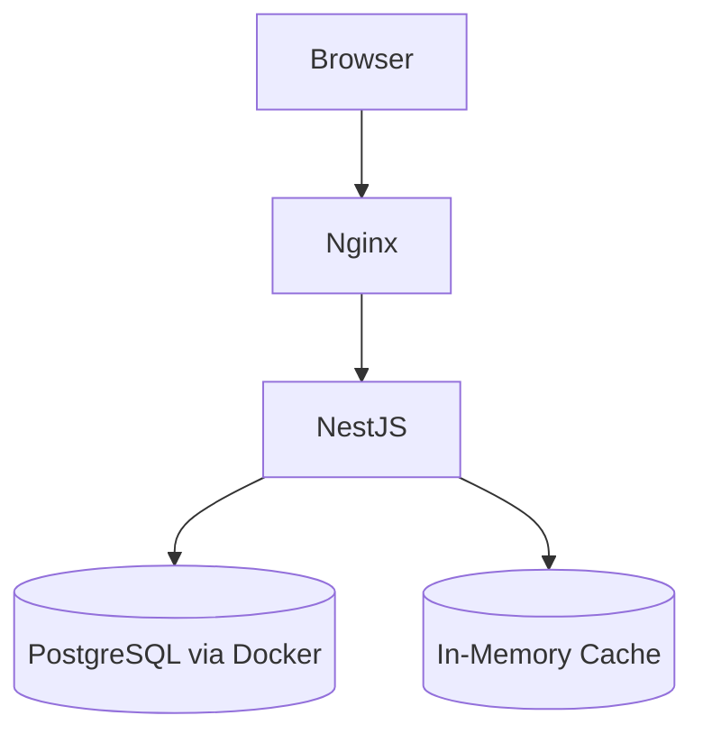

# 🌍 DesiVagabond

> **A personalized travel planning platform designed to simplify and enhance the travel experience.**

DesiVagabond allows users to create, manage, and share customized multi-city itineraries with budgeting, activity planning, and collaborative travel tools. The goal is to provide travelers with an intuitive and interactive platform where they can organize trips efficiently, visualize schedules, estimate expenses, and explore destinations seamlessly.

---

## ✨ Features

- 🔐 User Authentication (Login / Signup)
- 🗺️ Create and Manage Trips
- 🏙️ Multi-City Itinerary Builder
- 🔍 Activity and Destination Search
- 💰 Budget Estimation and Cost Breakdown
- 🧳 Packing Checklist
- 📓 Trip Notes and Journals
- 🔗 Public / Shared Itinerary Links
- 👤 User Profile and Preferences
- 📊 Admin Analytics Dashboard

---

## 🛠️ Tech Stack

| Layer | Technology |
|---|---|
| **Frontend** | React, Vite, TypeScript, Tailwind CSS |
| **Backend** | Node.js, NestJS, Prisma |
| **Database** | SQLite |
| **Version Control** | GitHub |

---

## 🚀 Installation & Setup

### 1. Clone the Repository

```bash
git clone <repository-url>
cd odoo-parul-virtual-round-NS
```

### 2. Frontend Setup

```bash
cd frontend
npm install
npm run dev
```

The frontend will start at: `http://localhost:5173`

### 3. Backend Setup

```bash
cd backend
npm install
```

Install required dependencies:

```bash
npm install @prisma/client prisma
npm install @nestjs/jwt passport-jwt bcrypt
npm install class-validator class-transformer
npm install @nestjs/swagger swagger-ui-express
```

Initialize Prisma:

```bash
npx prisma init
```

Start the backend server:

```bash
npm run start:dev
```

The backend will run at: `http://localhost:3000`

### 4. Database Migrations

TypeORM is used for database interactions. While `synchronize` is enabled in development, **production deployments must run migrations manually** before starting the server.

To generate a new migration after making entity changes:
```bash
npm run migration:generate src/migrations/MigrationName
```

To run pending migrations (required in production):
```bash
npm run migration:run
```

---

## 🔐 Environment Variables

Create a `.env` file inside the `backend/` directory:

```env
DATABASE_URL="file:./dev.db"
JWT_SECRET="your-secret-key"
PORT=3000
```

## 🏗️ Architecture



---

## 🗄️ Database

DesiVagabond supports both **SQLite** (default fallback) and **PostgreSQL**.

### Configuring the Database
By default, the backend will use SQLite stored in `./data/traveloop.db`. To use PostgreSQL, configure the following environment variables in your `backend/.env` file:

```env
DB_TYPE=postgres
DB_HOST=localhost
DB_PORT=5432
DB_USER=traveloop_user
DB_PASSWORD=traveloop_password
DB_NAME=traveloop
```

### Running with Docker Compose (PostgreSQL)
A `docker-compose.yml` file is provided to quickly spin up the app connected to a PostgreSQL instance:

```bash
docker-compose up -d
```

The database manages:
- Users
- Trips
- Itineraries
- Activities
- Budgets
- Notes
- Shared Trips
- Packing Lists

---

## 🌿 Recommended Development Workflow

### Branches

```
main
frontend
backend
```

### Workflow

- Frontend development happens in the `frontend` branch
- Backend development happens in the `backend` branch
- Stable, reviewed code is merged into `main`

---

## 📖 API Documentation

API documentation is available via **Swagger UI** after starting the backend server.

Example endpoint structure:

```
GET    /trips
POST   /trips
GET    /trips/:id
PUT    /trips/:id
DELETE /trips/:id
```

---

## 🔮 Future Enhancements

- 🤖 AI-powered itinerary generation
- 🤝 Real-time collaboration
- 💡 Smart budget optimization
- 🗺️ Map integration
- 🎯 Activity recommendations
- 🌤️ Weather integration
- 📈 Travel analytics
- 📱 Mobile application support

---

## 👥 Contributors

| Name | Role |
|---|---|
| [Srikara Varadan](https://github.com/) | Frontend Developer |
| [Nikhileswar](https://github.com/) | Backend Developer |

---

> Built with ❤️ for travelers everywhere.
